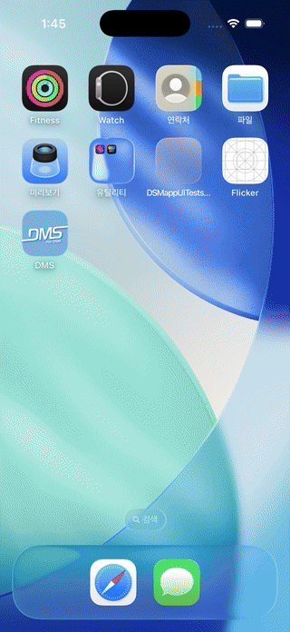

# Flicker

무작위 단어에서 "번뜩" 떠오르는 아이디어를 붙잡아 기록하는 iOS 노트 앱이에요. 한국어 낱말 목록에서 무작위로 받은 단어를 보며 생각을 떠올리고, 노트로 남기고, 그 단어와 관련된 뉴스 기사를 읽으며 아이디어를 넓혀갈 수 있어요.

## 만든 이유

학창 시절에는 공모전과 해커톤 같은 소프트웨어 개발 대회에 나갈 일이 많았어요. 대회마다 새로운 아이디어로 앱 서비스를 만들어야 했는데, 매번 빈 화면 앞에서 아이디어를 짜내는 게 어려웠어요. 아무 관련 없어 보이는 단어 하나가 오히려 새로운 발상의 출발점이 되곤 해서, 무작위 단어로 발상을 자극하는 도구를 직접 만들었어요.

## 데모

무작위 단어 "여권"에서 출발해 "취향을 기록하는 나만의 여권"이라는 아이디어 노트를 작성하고, 관련 기사까지 살펴보는 흐름이에요.



원본 영상은 [resource/demo.mp4](resource/demo.mp4)에서 볼 수 있어요.

## 주요 기능

- 한국어 위키낱말사전의 "자주 쓰이는 한국어 낱말 5800" 목록에서 무작위 단어 다섯 개를 받아 화면에 흩뿌려요.
- 마음에 드는 단어를 골라 아이디어 노트를 작성해요. 직접 정한 단어로도 시작할 수 있어요.
- 작성한 노트를 기기에 저장하고, 변경 사항을 보관함 목록에 실시간으로 반영해요.
- 노트의 핵심 단어로 네이버 뉴스를 검색해 관련 기사를 보여주고, 앱 안에서 바로 읽을 수 있어요.

## 동작 방식

번뜩 노트를 시작하면 위키낱말사전의 낱말 목록 페이지를 받아 Kanna로 파싱하고, 무작위로 고른 다섯 단어를 겹치지 않는 위치에 배치해요. 화면 곳곳에 흩어진 단어 버튼 중 하나를 고르면 그 단어로 노트를 시작해요.

노트는 Realm에 저장하고, RxRealm으로 변경 사항을 구독해서 보관함 목록에 실시간으로 반영해요. 관련 기사는 노트의 핵심 단어로 네이버 뉴스 검색 API를 호출해 가져오고, 선택한 기사는 WKWebView로 앱 안에서 열어요.

## 화면 구성

| 단어 선택 | 노트 작성 | 관련 기사 | 기사 읽기 |
| --- | --- | --- | --- |
|  |  |  |  |

- 보관함 화면에서 작성한 노트 목록을 보고, 새 노트를 시작해요.
- 단어 선택 화면에서 무작위 단어 다섯 개 중 하나를 골라요.
- 노트 화면에서 한 줄 설명과 내용을 작성하고 저장해요.
- 관련 기사 화면에서 핵심 단어로 검색한 뉴스를 보고, 기사를 앱 안에서 읽어요.

## 프로젝트 구조

```
Flicker/
├── Model/           노트·기사·위치 데이터 모델
├── ViewModel/       단어 로딩, 노트 목록, 기사 검색 로직
├── ViewController/  화면 (보관함, 단어 선택, 노트, 기사)
├── Util/            API 정의, 커스텀 뷰, 색상
└── UI/              스토리보드와 XIB
```

프로젝트 파일은 Tuist로 생성해요. `brew install tuist` 후 저장소 루트에서 `tuist generate`를 실행하면 `Flicker.xcworkspace`가 열려요.
