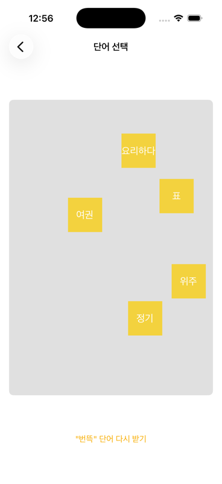

# Flicker

2018년 고등학생 때 만든 아이디어 발상용 iOS 노트 앱이에요.

학창 시절에는 공모전과 해커톤 같은 소프트웨어 개발 대회에 나갈 일이 많았어요. 대회마다 새로운 아이디어로 앱 서비스를 만들어야 했는데, 그 발상 과정에서 도움을 받고 싶어서 Flicker를 만들었어요. 무작위로 제시되는 단어에서 "번뜩" 떠오르는 생각을 붙잡아 노트로 남기고, 그 단어와 관련된 뉴스 기사를 읽으며 아이디어를 넓혀갈 수 있어요.

2026년 SBS 다큐멘터리 촬영을 계기로, 8년 만에 최신 iOS 환경에서 다시 동작하도록 복원했어요.

## 데모

무작위 단어 "여권"에서 출발해 "취향을 기록하는 나만의 여권"이라는 아이디어 노트를 작성하고, 관련 기사까지 살펴보는 흐름이에요. 전체 영상은 [resource/demo.mov](resource/demo.mov)에서 볼 수 있어요.

| 단어 선택 | 노트 작성 | 관련 기사 | 기사 읽기 |
| --- | --- | --- | --- |
|  |  |  |  |

## 주요 기능

- **번뜩 노트** — 한국어 위키낱말사전의 "자주 쓰이는 한국어 낱말 5800" 목록에서 무작위 단어 다섯 개를 받아 화면에 흩뿌려요. 마음에 드는 단어를 골라 아이디어 노트를 시작해요.
- **사용자 입력 노트** — 직접 정한 핵심 단어로 노트를 작성해요.
- **보관함** — 작성한 노트를 기기에 저장하고, 변경 사항을 목록에 실시간으로 반영해요.
- **관련 기사** — 노트의 핵심 단어로 네이버 뉴스를 검색해 관련 기사를 보여줘요. 기사를 앱 안에서 바로 읽으며 아이디어를 확장할 수 있어요.

## 기술 스택

- Swift 5, MVVM 구조, RxSwift 6
- 네트워크 Moya 15, 저장소 Realm, HTML 파싱 Kanna
- 프로젝트 생성 Tuist, 의존성 관리 Swift Package Manager

## 실행 방법

Tuist로 프로젝트 파일을 생성한 뒤 Xcode에서 실행해요.

```bash
brew install tuist
tuist generate
```

생성된 `Flicker.xcworkspace`가 Xcode에서 열리면 iOS 시뮬레이터를 선택하고 실행해요. `xcode-select`가 Command Line Tools를 가리키고 있으면 Tuist가 실패하는데, 그때는 `sudo xcode-select -s /Applications/Xcode.app`을 먼저 실행하세요.

## 2026년 복원 기록

원본 코드는 2018년 7월 "Change Moya But Not Work...." 커밋에서 멈춰 있었어요. 다음을 바꿔서 다시 동작하게 만들었어요.

- CocoaPods 의존성 7개를 Swift Package Manager로 옮기고, 프로젝트 생성을 Tuist로 관리해요.
- Swift 4를 5로, 배포 타겟을 iOS 11에서 15로, UIWebView를 WKWebView로 올렸어요.
- 네트워크가 동작하지 않던 원인을 찾아서 고쳤어요. `MoyaProvider`를 지역 변수로 만들어 요청이 시작하자마자 취소되던 버그였는데, 프로바이더를 프로퍼티로 유지하도록 바꿨어요. 이 수정으로 번뜩 노트와 관련 기사 기능이 처음으로 끝까지 동작해요.
